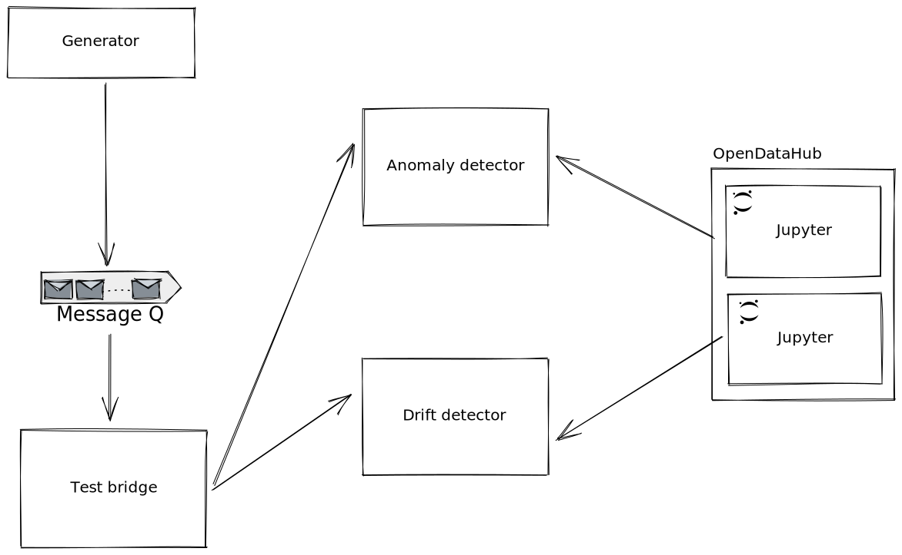

# rhose-experiments




## Preparing models

### Anomaly detection

To train the anomaly detection model, open the [model-training.ipynb Jupyter notebook](/anomaly-detection/model-training.ipynb).

The notebook will generate a suitable model that will be saved as a Dill file under [anomaly-detection/model](anomaly-detection/model/).

### Drift detection

Similarly to [anomaly detection](#anomaly-detection), open [drift-model-training-offline.ipynb](/drift-detector/drift-model-training-offline.ipynb).

## Running

### Using docker-compose

Start Kafka and the detectors using:

```shell
docker-compose up zookeeper broker anomaly-detector drift-detector --build -d
```

The generator can be started with

```shell
docker-compose up generator --build -d
```

Optionally, a test "bridge" (i.e. a simple service forwarding incoming data to both the anomaly and drift detector, collating responses and displaying on a dashboard) can be started with

```shell
docker-compose up test-bridge --build -d
```


## Anomaly detection

### Payload
```
curl -X POST  http://localhost:9000/predict \
   -H 'Content-Type: application/json' \
   -d '{"y": 210}'
```